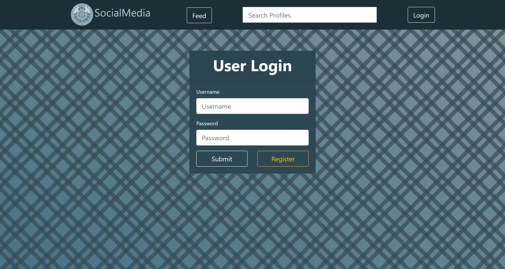
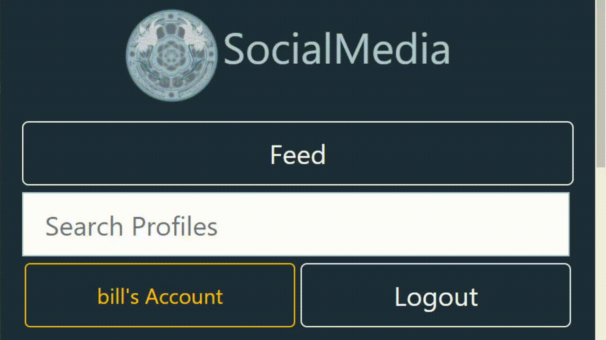
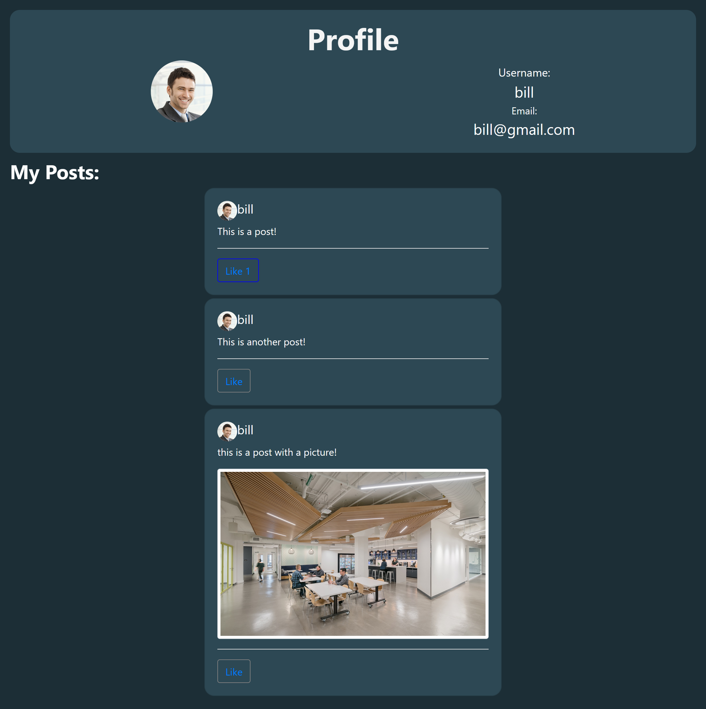
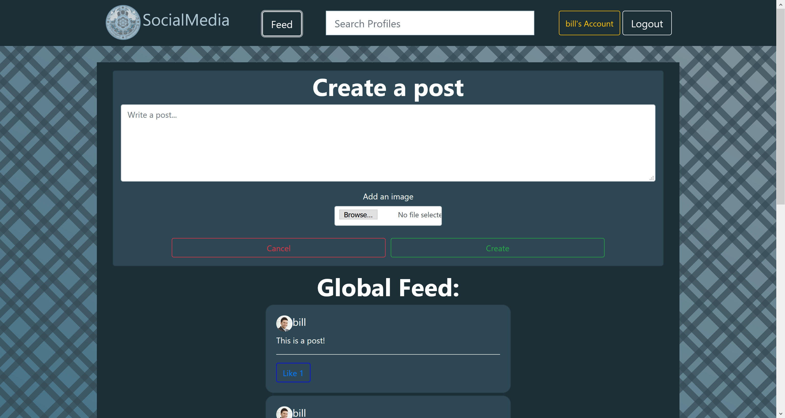

# Revature Social Network

## Description

In Revature's Social Network everyone is friends with everyone else. Users can register, login to the application, and start sharing multimedia with everyone. Registered users are allowed to modify their personal information and upload their profile pictures. The application provides a search feature that allows users to search out friends and look at their profiles. Users are provided with a "feed", in which they can see what everyone is posting and like posts. Users can access and use the application via an interactive client-side single paged application that stores and retrieves multimedia using AWS S3 and consumes a RESTful web service that provides business logic and access to a database.

## IDEs Used

* Spring Tools Suite
* Visual Studio Code

## Technologies Used

* Java, Maven & JUnit
* Hibernate & Spring
* HTML, CSS, TypeScript & React
* Bootstrap 5

## Features

* Securely stored passwords
  * Hashing on back-end
* Responsive styling
  * Clear on all screen sizes
  * Large inputs for easy accessibility

## Getting Started

* Clone project with `git clone https://github.com/nsmith513/RevatureSocialNetwork.git`
* Set up back-end environment variables:
```
DB_URL=YOUR_DB_URL_HERE
DB_USERNAME=YOUR_USERNAME_HERE
DB_PASSWORD=YOUR_PASSWORD_HERE
```
* Set up front-end envoirnment variables:
```
REACT_APP_API_URL=http://localhost:TOMCAT_PORT/
REACT_APP_ACCESS_ID=YOUR_AWS_S3_BUCKET_ACCESS_ID_HERE
REACT_APP_ACCESS_KEY=YOUR_AWS_S3_BUCKET_ACCESS_KEY_HERE
REACT_APP_BUCKET_NAME=YOUR_AWS_S3_BUCKET_NAME_HERE
REACT_APP_REGION=YOUR_AWS_S3_BUCKET_REGION_HERE
```
* Compile ProjectTwoSTS with Maven and deploy to Tomcat on whichever port you defined for `REACT_APP_API_URL`
* Start React server with `npm start`

## Usage

Employees can login and navigate using the navbar.

<p>
   <kbd></kbd>
   <kbd></kbd>
</p>

Users can view the posts and profiles of themselves and other users as well as the global feed.

<p>
   <kbd></kbd>
   <br/>
   <br/>
   <kbd></kbd>
</p>

## License

Created by Jasmine Kocacal, Nicholas Smith, Nikolaus Arboleda and Zachary Jamison, licenced under Apache 2.0: https://www.apache.org/licenses/LICENSE-2.0.html
